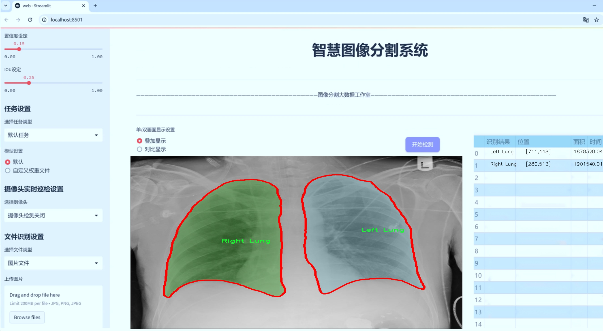

# x光胸片肺部结构分割系统源码＆数据集分享
 [yolov8-seg-RevCol＆yolov8-seg-C2f-RFAConv等50+全套改进创新点发刊_一键训练教程_Web前端展示]

### 1.研究背景与意义

项目参考[ILSVRC ImageNet Large Scale Visual Recognition Challenge](https://gitee.com/YOLOv8_YOLOv11_Segmentation_Studio/projects)

项目来源[AAAI Global Al lnnovation Contest](https://kdocs.cn/l/cszuIiCKVNis)

研究背景与意义

随着医学影像技术的快速发展，X光胸片作为一种常见的影像学检查手段，在肺部疾病的早期诊断和治疗中发挥着重要作用。肺部疾病的种类繁多，包括肺炎、肺结核、肺癌等，其中肺不张（Atelectasis）作为一种常见的病理状态，常常在临床中被忽视。肺不张的早期识别和准确评估对于提高患者的生存率和改善预后具有重要意义。因此，开发一种高效、准确的肺部结构分割系统，能够为临床医生提供更为精确的诊断依据，具有重要的研究价值和实际应用意义。

近年来，深度学习技术在医学影像分析领域取得了显著进展，尤其是目标检测和分割任务中，YOLO（You Only Look Once）系列模型因其高效性和准确性而受到广泛关注。YOLOv8作为该系列的最新版本，结合了多种先进的网络结构和算法，具备了更强的特征提取能力和实时处理能力。然而，传统的YOLOv8模型在处理医学影像时，尤其是在细粒度结构分割方面，仍然面临一些挑战。这些挑战主要体现在对复杂结构的识别能力不足、对小目标的检测精度不高以及在处理不同病理状态时的泛化能力不足等方面。因此，基于改进YOLOv8的肺部结构分割系统的研究，旨在通过对模型的优化与改进，提升其在X光胸片中肺部结构的分割精度和鲁棒性。

本研究所使用的数据集包含6300幅X光胸片，涵盖了心脏、左肺、右肺、脊柱和气管等五个类别。这一数据集的丰富性为模型的训练和验证提供了良好的基础。通过对这些结构的精确分割，不仅可以帮助医生更好地识别肺部病变，还能为后续的定量分析提供数据支持。例如，心脏与肺部的相对位置、肺部的通气状态等信息都可以通过精确的结构分割进行量化，从而为临床决策提供科学依据。

此外，基于改进YOLOv8的肺部结构分割系统的研究，具有重要的社会意义。随着人口老龄化和环境污染的加剧，肺部疾病的发病率逐年上升，如何提高肺部疾病的早期诊断率，成为了公共卫生领域亟待解决的问题。通过构建高效的自动化分割系统，可以减轻医生的工作负担，提高诊断效率，从而在一定程度上缓解医疗资源紧张的问题。同时，该系统的成功应用也为其他类型的医学影像分析提供了借鉴，推动了医学影像智能化的发展。

综上所述，基于改进YOLOv8的X光胸片肺部结构分割系统的研究，不仅在技术上具有重要的创新意义，也在临床应用和社会价值上具有深远的影响。通过这一研究，期望能够为肺部疾病的早期诊断和治疗提供有力支持，推动医学影像分析领域的进一步发展。

### 2.图片演示




##### 注意：由于此博客编辑较早，上面“2.图片演示”和“3.视频演示”展示的系统图片或者视频可能为老版本，新版本在老版本的基础上升级如下：（实际效果以升级的新版本为准）

  （1）适配了YOLOV8的“目标检测”模型和“实例分割”模型，通过加载相应的权重（.pt）文件即可自适应加载模型。

  （2）支持“图片识别”、“视频识别”、“摄像头实时识别”三种识别模式。

  （3）支持“图片识别”、“视频识别”、“摄像头实时识别”三种识别结果保存导出，解决手动导出（容易卡顿出现爆内存）存在的问题，识别完自动保存结果并导出到tempDir中。

  （4）支持Web前端系统中的标题、背景图等自定义修改，后面提供修改教程。

  另外本项目提供训练的数据集和训练教程,暂不提供权重文件（best.pt）,需要您按照教程进行训练后实现图片演示和Web前端界面演示的效果。

### 3.视频演示

[3.1 视频演示](https://www.bilibili.com/video/BV1L4DmYtEU6/)

### 4.数据集信息展示

##### 4.1 本项目数据集详细数据（类别数＆类别名）

nc: 2
names: ['Left Lung', 'Right Lung']


##### 4.2 本项目数据集信息介绍

数据集信息展示

在本研究中，我们采用了名为“Atelectasis”的数据集，以支持对YOLOv8-seg模型的训练，旨在改进其在X光胸片中肺部结构的分割能力。该数据集专注于肺部解剖结构的精确识别，特别是针对左肺和右肺的分割任务。通过对该数据集的深入分析，我们可以更好地理解其构成及其在模型训练中的重要性。

“Atelectasis”数据集包含两个主要类别，分别是“Left Lung”（左肺）和“Right Lung”（右肺）。这两个类别的选择反映了肺部结构在医学影像学中的重要性，尤其是在诊断和治疗肺部疾病时。数据集中每个类别的样本均经过精心标注，确保模型在训练过程中能够获得高质量的监督信号。左肺和右肺的分割不仅有助于提高模型对肺部结构的理解，还能在临床应用中提供更为准确的辅助诊断工具。

数据集的设计旨在涵盖多样化的X光胸片图像，以确保模型在不同情况下的鲁棒性。图像中可能包含各种肺部病变和解剖变异，这为模型的训练提供了丰富的样本基础。通过使用“Atelectasis”数据集，我们的目标是让YOLOv8-seg模型能够学习到左肺和右肺的特征，从而在实际应用中实现精确的肺部结构分割。

在训练过程中，数据集的类别数量和标注质量将直接影响模型的性能。由于我们仅关注两个类别，模型的学习任务相对明确，这有助于提高分割的准确性。通过对每个类别的特征进行深入学习，模型能够更好地识别和分割肺部结构，进而提升在临床影像分析中的应用价值。

此外，数据集的多样性也为模型的泛化能力提供了保障。我们将通过多种数据增强技术，进一步丰富数据集的表现形式，以提高模型在不同条件下的适应能力。这些技术包括旋转、缩放、翻转等，旨在模拟实际临床环境中可能遇到的各种情况。通过这样的处理，我们希望模型能够在面对新图像时，依然保持良好的分割性能。

总之，“Atelectasis”数据集为我们改进YOLOv8-seg模型提供了坚实的基础。通过对左肺和右肺的精确分割，我们不仅能够提高模型的性能，还能为肺部疾病的早期诊断和治疗提供重要支持。随着模型的不断优化和数据集的进一步扩展，我们期待在肺部影像分析领域取得更为显著的进展。


### 5.全套项目环境部署视频教程（零基础手把手教学）

[5.1 环境部署教程链接（零基础手把手教学）](https://www.bilibili.com/video/BV1jG4Ve4E9t/?vd_source=bc9aec86d164b67a7004b996143742dc)


[5.2 安装Python虚拟环境创建和依赖库安装视频教程链接（零基础手把手教学）](https://www.bilibili.com/video/BV1nA4VeYEze/?vd_source=bc9aec86d164b67a7004b996143742dc)

### 6.手把手YOLOV8-seg训练视频教程（零基础小白有手就能学会）

[6.1 手把手YOLOV8-seg训练视频教程（零基础小白有手就能学会）](https://www.bilibili.com/video/BV1cA4VeYETe/?vd_source=bc9aec86d164b67a7004b996143742dc)


按照上面的训练视频教程链接加载项目提供的数据集，运行train.py即可开始训练



     Epoch   gpu_mem       box       obj       cls    labels  img_size
     1/200     0G   0.01576   0.01955  0.007536        22      1280: 100%|██████████| 849/849 [14:42<00:00,  1.04s/it]
               Class     Images     Labels          P          R     mAP@.5 mAP@.5:.95: 100%|██████████| 213/213 [01:14<00:00,  2.87it/s]
                 all       3395      17314      0.994      0.957      0.0957      0.0843

     Epoch   gpu_mem       box       obj       cls    labels  img_size
     2/200     0G   0.01578   0.01923  0.007006        22      1280: 100%|██████████| 849/849 [14:44<00:00,  1.04s/it]
               Class     Images     Labels          P          R     mAP@.5 mAP@.5:.95: 100%|██████████| 213/213 [01:12<00:00,  2.95it/s]
                 all       3395      17314      0.996      0.956      0.0957      0.0845

     Epoch   gpu_mem       box       obj       cls    labels  img_size
     3/200     0G   0.01561    0.0191  0.006895        27      1280: 100%|██████████| 849/849 [10:56<00:00,  1.29it/s]
               Class     Images     Labels          P          R     mAP@.5 mAP@.5:.95: 100%|███████   | 187/213 [00:52<00:00,  4.04it/s]
                 all       3395      17314      0.996      0.957      0.0957      0.0845


### 7.50+种全套YOLOV8-seg创新点代码加载调参视频教程（一键加载写好的改进模型的配置文件）

[7.1 50+种全套YOLOV8-seg创新点代码加载调参视频教程（一键加载写好的改进模型的配置文件）](https://www.bilibili.com/video/BV1Hw4VePEXv/?vd_source=bc9aec86d164b67a7004b996143742dc)

### 8.YOLOV8-seg图像分割算法原理

原始YOLOv8-seg算法原理

YOLOv8-seg作为YOLO系列中的最新进展，继承并扩展了YOLOv5的设计理念，致力于在目标检测和分割任务中实现更高的精度和更快的速度。该算法的核心在于其独特的网络结构和高效的特征提取机制，使其在多种应用场景中表现出色。YOLOv8-seg的架构由输入端、骨干网络、颈部网络和头部网络四个主要部分组成，各部分相辅相成，共同推动了模型性能的提升。

在输入端，YOLOv8-seg采用了马赛克数据增强技术，这一方法通过将多张图像拼接成一张新图像，增加了训练数据的多样性，从而提升了模型的泛化能力。此外，自适应锚框计算和自适应灰度填充的引入，使得输入图像在经过预处理后能够更好地适应不同的目标检测任务。这一系列的输入处理步骤为后续的特征提取奠定了坚实的基础。

骨干网络是YOLOv8-seg的核心组成部分，其采用了改进的C2f结构和SPPF（Spatial Pyramid Pooling Fusion）模块。C2f模块通过跨层连接和更多的分支结构，增强了模型的梯度流，进而提升了特征表示能力。这种设计不仅使得网络能够更有效地学习到目标的特征，还提高了对复杂场景的适应能力。SPPF模块则通过多尺度池化操作，进一步增强了网络对不同尺度目标的特征抽象能力，使得模型在处理具有不同尺寸的目标时表现得更加灵活。

颈部网络采用了路径聚合网络（PAN）结构，这一设计旨在增强不同尺度特征的融合能力。PAN通过有效地整合来自骨干网络的多层特征图，确保了模型在进行目标检测时能够充分利用各层次的信息。这种特征融合策略使得YOLOv8-seg在处理复杂场景时，能够更好地捕捉到目标的细节信息，从而提高了检测的准确性。

头部网络则是YOLOv8-seg的关键环节，它将分类和检测过程进行了有效的解耦。通过引入Task-Aligned Assigner策略，YOLOv8-seg能够根据分类与回归的分数加权结果来选择正样本，这一方法显著提高了样本分配的合理性。损失计算过程涵盖了分类和回归两个分支，其中分类分支采用了二元交叉熵损失（BCELoss），而回归分支则结合了分布焦点损失（DFLoss）和完全交并比损失函数（CIOULoss），以提升模型对边界框预测的精准性。这种解耦设计不仅简化了模型的训练过程，还提高了检测的效率和准确性。

YOLOv8-seg的另一大创新在于其无锚框检测头的引入，取代了传统的锚框预测方式。这一改变使得模型在进行目标检测时，能够减少锚框的预测数量，从而加速了非最大抑制（NMS）过程，进一步提升了模型的实时性。这种无锚框的设计理念，使得YOLOv8-seg在处理动态场景时，能够更加迅速地响应目标的变化，适应性更强。

综上所述，YOLOv8-seg算法通过其独特的网络结构和高效的特征提取机制，在目标检测和分割任务中实现了显著的性能提升。其输入端的多样化处理、骨干网络的特征提取能力、颈部网络的特征融合策略以及头部网络的解耦设计，共同构成了这一高效算法的核心。YOLOv8-seg不仅在精度和速度上超越了前代模型，更为实际应用提供了更为强大的支持，使其在智能监控、自动驾驶、医疗影像等领域展现出广阔的应用前景。随着技术的不断进步，YOLOv8-seg无疑将成为目标检测和分割领域的重要工具，为相关研究和应用带来新的机遇和挑战。


### 9.系统功能展示（检测对象为举例，实际内容以本项目数据集为准）

图9.1.系统支持检测结果表格显示

  图9.2.系统支持置信度和IOU阈值手动调节

  图9.3.系统支持自定义加载权重文件best.pt(需要你通过步骤5中训练获得)

  图9.4.系统支持摄像头实时识别

  图9.5.系统支持图片识别

  图9.6.系统支持视频识别

  图9.7.系统支持识别结果文件自动保存

  图9.8.系统支持Excel导出检测结果数据


### 10.50+种全套YOLOV8-seg创新点原理讲解（非科班也可以轻松写刊发刊，V11版本正在科研待更新）

#### 10.1 由于篇幅限制，每个创新点的具体原理讲解就不一一展开，具体见下列网址中的创新点对应子项目的技术原理博客网址【Blog】：


[10.1 50+种全套YOLOV8-seg创新点原理讲解链接](https://gitee.com/qunmasj/good)

#### 10.2 部分改进模块原理讲解(完整的改进原理见上图和技术博客链接)【如果此小节的图加载失败可以通过CSDN或者Github搜索该博客的标题访问原始博客，原始博客图片显示正常】

### YOLOv8简介
YOLOv8是一种目标检测模型，是基于YOLO (You Only Look Once)系列算法发展而来的最新版本。它的核心思想是将目标检测任务转化为一个回归问题，通过单次前向传播即可直接预测出图像中的多个目标的位置和类别。
YOLOv8的网络结构采用了Darknet作为其主干网络，主要由卷积层和池化层构成。与之前的版本相比，YOLOv8在网络结构上进行了改进，引入了更多的卷积层和残差模块，以提高模型的准确性和鲁棒性。
YOLOv8采用了一种特征金字塔网络(Feature Pyramid Network,FPN)的结构，通过在不同层级上融合多尺度的特征信息，可以对不同尺度的目标进行有效的检测。此外，YOLOv8还引入了一种自适应感知域(Adaptive Anchors
的机制，通过自适应地学习目标的尺度和
长宽比，提高了模型对于不同尺度和形状目标的检测效果。
总体来说，YOLOv8结构模型综合了多个先进的目标检测技术，在保证检测速度的同时提升了检测精度和鲁棒性，被广泛应用于实时目标检测任务中。


#### yolov8网络模型结构图

YOLOv8 (You Only Look Once version 8)是一种目标检测算法，它在实时场景下可以快速准确地检测图像中的目标。
YOLOv8的网络模型结构基于Darknet框架，由一系列卷积层、池化层和全连接层组成。主要包含以下几个组件:
1.输入层:接收输入图像。
2.卷积层:使用不同尺寸的卷积核来提取图像特征。
3.残差块(Residual blocks):通过使用跳跃连接(skip connections）来解决梯度消失问题，使得网络更容易训练。
4.上采样层(Upsample layers):通过插值操作将特征图的尺寸放大，以便在不同尺度上进行目标检测。
5.池化层:用于减小特征图的尺寸，同时保留重要的特征。
6.1x1卷积层:用于降低通道数，减少网络参数量。
7.3x3卷积层:用于进—步提取和组合特征。
8.全连接层:用于最后的目标分类和定位。
YOLOv8的网络结构采用了多个不同尺度的特征图来检测不同大小的目标，从而提高了目标检测的准确性和多尺度性能。
请注意，YOLOv8网络模型结构图的具体细节可能因YOLO版本和实现方式而有所不同。


#### yolov8模型结构
YOLOv8模型是一种目标检测模型，其结构是基于YOLOv3模型进行改进的。模型结构可以分为主干网络和检测头两个部分。
主干网络是一种由Darknet-53构成的卷积神经网络。Darknet-53是一个经过多层卷积和残差连接构建起来的深度神经网络。它能够提取图像的特征信息，并将这些信息传递给检测头。
检测头是YOLOv8的关键部分，它负责在图像中定位和识别目标。检测头由一系列卷积层和全连接层组成。在每个检测头中，会生成一组锚框，并针对每个锚框预测目标的类别和位置信息。
YOLOv8模型使用了预训练的权重，其中在COCO数据集上进行了训练。这意味着该模型已经通过大规模数据集的学习，具有一定的目标检测能力。

### RT-DETR骨干网络HGNetv2简介
#### RT-DETR横空出世
前几天被百度的RT-DETR刷屏，参考该博客提出的目标检测新范式对原始DETR的网络结构进行了调整和优化，以提高计算速度和减小模型大小。这包括使用更轻量级的基础网络和调整Transformer结构。并且，摒弃了nms处理的detr结构与传统的物体检测方法相比，不仅训练是端到端的，检测也能端到端，这意味着整个网络在训练过程中一起进行优化，推理过程不需要昂贵的后处理代价，这有助于提高模型的泛化能力和性能。


当然，人们对RT-DETR之所以产生浓厚的兴趣，我觉得大概率还是对YOLO系列审美疲劳了，就算是出到了YOLO10086，我还是只想用YOLOv5和YOLOv7的框架来魔改做业务。。

#### 初识HGNet
看到RT-DETR的性能指标，发现指标最好的两个模型backbone都是用的HGNetv2，毫无疑问，和当时的picodet一样，骨干都是使用百度自家的网络。初识HGNet的时候，当时是参加了第四届百度网盘图像处理大赛，文档图像方向识别专题赛道，简单来说，就是使用分类网络对一些文档截图或者图片进行方向角度分类。


当时的方案并没有那么快定型，通常是打榜过程发现哪个网络性能好就使用哪个网络做魔改，而且木有显卡，只能蹭Ai Studio的平台，不过v100一天8小时的实验时间有点短，这也注定了大模型用不了。 

流水的模型，铁打的炼丹人，最后发现HGNet-tiny各方面指标都很符合我们的预期，后面就一直围绕它魔改。当然，比赛打榜是目的，学习才是享受过程，当时看到效果还可以，便开始折腾起了HGNet的网络架构，我们可以看到，PP-HGNet 针对 GPU 设备，对目前 GPU 友好的网络做了分析和归纳，尽可能多的使用 3x3 标准卷积（计算密度最高），PP-HGNet是由多个HG-Block组成，细节如下：


ConvBNAct是啥？简单聊一聊，就是Conv+BN+Act，CV Man应该最熟悉不过了：
```python
class ConvBNAct(TheseusLayer):
    def __init__(self,
                 in_channels,
                 out_channels,
                 kernel_size,
                 stride,
                 groups=1,
                 use_act=True):
        super().__init__()
        self.use_act = use_act
        self.conv = Conv2D(
            in_channels,
            out_channels,
            kernel_size,
            stride,
            padding=(kernel_size - 1) // 2,
            groups=groups,
            bias_attr=False)
        self.bn = BatchNorm2D(
            out_channels,
            weight_attr=ParamAttr(regularizer=L2Decay(0.0)),
            bias_attr=ParamAttr(regularizer=L2Decay(0.0)))
        if self.use_act:
            self.act = ReLU()
 
    def forward(self, x):
        x = self.conv(x)
        x = self.bn(x)
        if self.use_act:
            x = self.act(x)
        return x 
```
且标准卷积的数量随层数深度增加而增多，从而得到一个有利于 GPU 推理的骨干网络，同样速度下，精度也超越其他 CNN ，性价比也优于ViT-base模型。


另外，我们可以看到：

PP-HGNet 的第一层由channel为96的Stem模块构成，目的是为了减少参数量和计算量。PP-HGNet

Tiny的整体结构由四个HG Stage构成，而每个HG Stage主要由包含大量标准卷积的HG Block构成。

PP-HGNet的第三到第五层使用了使用了可学习的下采样层（LDS Layer），该层group为输入通道数，可达到降参降计算量的作用，且Tiny模型仅包含三个LDS Layer，并不会对GPU的利用率造成较大影响.

PP-HGNet的激活函数为Relu，常数级操作可保证该模型在硬件上的推理速度。

### 11.项目核心源码讲解（再也不用担心看不懂代码逻辑）

#### 11.1 ultralytics\models\rtdetr\train.py

以下是经过简化和注释的核心代码部分：

```python
# 导入必要的库
from copy import copy
import torch
from ultralytics.models.yolo.detect import DetectionTrainer
from ultralytics.nn.tasks import RTDETRDetectionModel
from ultralytics.utils import RANK, colorstr
from .val import RTDETRDataset, RTDETRValidator

class RTDETRTrainer(DetectionTrainer):
    """
    RT-DETR模型的训练类，继承自YOLO的DetectionTrainer类。
    该模型由百度开发，旨在实现实时目标检测，利用视觉变换器（Vision Transformers）和其他特性。
    """

    def get_model(self, cfg=None, weights=None, verbose=True):
        """
        初始化并返回一个用于目标检测的RT-DETR模型。

        参数:
            cfg (dict, optional): 模型配置，默认为None。
            weights (str, optional): 预训练模型权重的路径，默认为None。
            verbose (bool): 是否详细记录日志，默认为True。

        返回:
            (RTDETRDetectionModel): 初始化后的模型。
        """
        # 创建RT-DETR检测模型实例
        model = RTDETRDetectionModel(cfg, nc=self.data['nc'], verbose=verbose and RANK == -1)
        if weights:
            model.load(weights)  # 加载预训练权重
        return model

    def build_dataset(self, img_path, mode='val', batch=None):
        """
        构建并返回用于训练或验证的RT-DETR数据集。

        参数:
            img_path (str): 包含图像的文件夹路径。
            mode (str): 数据集模式，'train'或'val'。
            batch (int, optional): 矩形训练的批量大小，默认为None。

        返回:
            (RTDETRDataset): 特定模式的数据集对象。
        """
        # 创建RT-DETR数据集实例
        return RTDETRDataset(img_path=img_path,
                             imgsz=self.args.imgsz,
                             batch_size=batch,
                             augment=mode == 'train',  # 训练模式下进行数据增强
                             hyp=self.args,
                             rect=False,
                             cache=self.args.cache or None,
                             prefix=colorstr(f'{mode}: '),  # 添加模式前缀
                             data=self.data)

    def get_validator(self):
        """
        返回适合RT-DETR模型验证的检测验证器。

        返回:
            (RTDETRValidator): 模型验证器对象。
        """
        self.loss_names = 'giou_loss', 'cls_loss', 'l1_loss'  # 定义损失名称
        return RTDETRValidator(self.test_loader, save_dir=self.save_dir, args=copy(self.args))

    def preprocess_batch(self, batch):
        """
        预处理一批图像，缩放并转换为浮点格式。

        参数:
            batch (dict): 包含图像、边界框和标签的批量字典。

        返回:
            (dict): 预处理后的批量数据。
        """
        batch = super().preprocess_batch(batch)  # 调用父类的预处理方法
        bs = len(batch['img'])  # 获取批量大小
        batch_idx = batch['batch_idx']  # 获取批量索引
        gt_bbox, gt_class = [], []  # 初始化真实边界框和类别列表
        
        # 遍历每个样本，提取对应的边界框和类别
        for i in range(bs):
            gt_bbox.append(batch['bboxes'][batch_idx == i].to(batch_idx.device))  # 获取当前样本的边界框
            gt_class.append(batch['cls'][batch_idx == i].to(device=batch_idx.device, dtype=torch.long))  # 获取当前样本的类别
        return batch  # 返回预处理后的批量数据
```

### 代码说明：
1. **类定义**：`RTDETRTrainer`类用于训练RT-DETR模型，继承自YOLO的`DetectionTrainer`类。
2. **模型初始化**：`get_model`方法用于创建RT-DETR模型并加载预训练权重。
3. **数据集构建**：`build_dataset`方法用于根据给定的图像路径和模式构建数据集。
4. **验证器获取**：`get_validator`方法返回一个适合RT-DETR模型的验证器。
5. **批量预处理**：`preprocess_batch`方法对输入的图像批量进行预处理，包括缩放和类型转换，并提取真实的边界框和类别信息。

这个程序文件是一个用于训练RT-DETR模型的Python脚本，文件名为`train.py`，它是Ultralytics YOLO框架的一部分。RT-DETR是一种基于视觉变换器（Vision Transformers）的实时目标检测模型，由百度开发。该文件主要定义了一个名为`RTDETRTrainer`的类，继承自`DetectionTrainer`类，以适应RT-DETR模型的特定特性和架构。

在文件开头，导入了一些必要的库和模块，包括`torch`和Ultralytics的相关模块。接着，`RTDETRTrainer`类的文档字符串详细描述了该类的功能、注意事项以及使用示例。该模型具备一些先进的特性，如IoU感知查询选择和可调的推理速度。此外，文档中提到了一些使用注意事项，例如在RT-DETR中使用的`F.grid_sample`不支持`deterministic=True`参数，以及AMP训练可能导致NaN输出和在二分图匹配过程中出现错误。

`RTDETRTrainer`类中定义了多个方法。`get_model`方法用于初始化并返回一个RT-DETR模型，接受模型配置、预训练权重路径和详细日志选项作为参数。如果提供了权重路径，则会加载相应的预训练权重。

`build_dataset`方法用于构建并返回一个RT-DETR数据集，支持训练和验证模式。该方法接受图像路径、模式（训练或验证）和批量大小作为参数，并返回相应的数据集对象。

`get_validator`方法返回一个适用于RT-DETR模型验证的`DetectionValidator`对象。在此方法中，还定义了损失名称，包括GIoU损失、分类损失和L1损失。

`preprocess_batch`方法用于预处理一批图像，主要功能是对图像进行缩放并转换为浮点格式。该方法接受一个包含图像、边界框和标签的字典作为输入，并返回经过预处理的批次数据。在处理过程中，它会根据批次索引将真实边界框和类别信息提取并转换为适当的设备格式。

整体而言，这个文件提供了RT-DETR模型训练的基本框架和实现细节，便于用户进行目标检测任务的训练和验证。

#### 11.2 ultralytics\hub\session.py

以下是代码中最核心的部分，并附上详细的中文注释：

```python
import signal
import sys
from pathlib import Path
from time import sleep
import requests
from ultralytics.hub.utils import HUB_API_ROOT, HUB_WEB_ROOT, smart_request
from ultralytics.utils import LOGGER, __version__, checks, is_colab
from ultralytics.utils.errors import HUBModelError

AGENT_NAME = f'python-{__version__}-colab' if is_colab() else f'python-{__version__}-local'

class HUBTrainingSession:
    """
    HUB 训练会话，用于 Ultralytics HUB YOLO 模型。处理模型初始化、心跳和检查点上传。
    """

    def __init__(self, url):
        """
        初始化 HUBTrainingSession，使用提供的模型标识符。

        参数:
            url (str): 用于初始化 HUB 训练会话的模型标识符。
        
        异常:
            ValueError: 如果提供的模型标识符无效。
            ConnectionError: 如果连接全局 API 密钥不被支持。
        """
        from ultralytics.hub.auth import Auth

        # 解析输入的 URL
        if url.startswith(f'{HUB_WEB_ROOT}/models/'):
            url = url.split(f'{HUB_WEB_ROOT}/models/')[-1]
        if [len(x) for x in url.split('_')] == [42, 20]:
            key, model_id = url.split('_')
        elif len(url) == 20:
            key, model_id = '', url
        else:
            raise HUBModelError(f"model='{url}' not found. Check format is correct.")

        # 授权
        auth = Auth(key)
        self.agent_id = None  # 标识与服务器通信的实例
        self.model_id = model_id
        self.model_url = f'{HUB_WEB_ROOT}/models/{model_id}'
        self.api_url = f'{HUB_API_ROOT}/v1/models/{model_id}'
        self.auth_header = auth.get_auth_header()
        self.rate_limits = {'metrics': 3.0, 'ckpt': 900.0, 'heartbeat': 300.0}  # API 调用的速率限制（秒）
        self.metrics_queue = {}  # 模型的指标队列
        self.model = self._get_model()  # 获取模型数据
        self.alive = True  # 心跳循环是否活跃
        self._start_heartbeat()  # 启动心跳
        self._register_signal_handlers()  # 注册信号处理器
        LOGGER.info(f'查看模型在 {self.model_url} 🚀')

    def _get_model(self):
        """从 Ultralytics HUB 获取并返回模型数据。"""
        api_url = f'{HUB_API_ROOT}/v1/models/{self.model_id}'

        try:
            response = smart_request('get', api_url, headers=self.auth_header, thread=False, code=0)
            data = response.json().get('data', None)

            if data.get('status', None) == 'trained':
                raise ValueError('模型已经训练并上传。')

            if not data.get('data', None):
                raise ValueError('数据集可能仍在处理。请稍等片刻再试。')
            self.model_id = data['id']

            if data['status'] == 'new':  # 新模型开始训练
                self.train_args = {
                    'batch': data['batch_size'],
                    'epochs': data['epochs'],
                    'imgsz': data['imgsz'],
                    'patience': data['patience'],
                    'device': data['device'],
                    'cache': data['cache'],
                    'data': data['data']}
                self.model_file = data.get('cfg') or data.get('weights')
                self.model_file = checks.check_yolov5u_filename(self.model_file, verbose=False)
            elif data['status'] == 'training':  # 继续训练现有模型
                self.train_args = {'data': data['data'], 'resume': True}
                self.model_file = data['resume']

            return data
        except requests.exceptions.ConnectionError as e:
            raise ConnectionRefusedError('ERROR: HUB 服务器未在线。请稍后再试。') from e
        except Exception:
            raise

    @threaded
    def _start_heartbeat(self):
        """开始一个线程心跳循环，向 Ultralytics HUB 报告代理的状态。"""
        while self.alive:
            r = smart_request('post',
                              f'{HUB_API_ROOT}/v1/agent/heartbeat/models/{self.model_id}',
                              json={
                                  'agent': AGENT_NAME,
                                  'agentId': self.agent_id},
                              headers=self.auth_header,
                              retry=0,
                              code=5,
                              thread=False)  # 已经在一个线程中
            self.agent_id = r.json().get('data', {}).get('agentId', None)
            sleep(self.rate_limits['heartbeat'])  # 根据速率限制进行睡眠
```

### 代码说明：
1. **HUBTrainingSession 类**：用于管理与 Ultralytics HUB 的训练会话，包括模型的初始化、心跳信号的发送和模型检查点的上传。
2. **`__init__` 方法**：初始化类实例，解析模型 URL，进行授权，并获取模型数据。
3. **`_get_model` 方法**：从 Ultralytics HUB 获取模型的状态和参数，处理不同状态的模型（新模型或正在训练的模型）。
4. **`_start_heartbeat` 方法**：在一个独立线程中定期向 HUB 发送心跳信号，报告代理的状态，确保会话保持活跃。

这个程序文件是Ultralytics YOLO模型的一个训练会话管理类，主要用于处理模型的初始化、心跳监测和检查点上传等功能。文件中首先导入了一些必要的库和模块，包括信号处理、系统操作、路径处理、时间延迟、HTTP请求等。

在类`HUBTrainingSession`的构造函数中，接收一个模型标识符`url`，用于初始化训练会话。构造函数首先解析输入的URL，提取出模型的键和ID，并进行授权。接着，它构建了一些重要的属性，包括模型的URL、API URL、身份验证头、速率限制、定时器、模型的度量队列以及从Ultralytics HUB获取的模型数据。然后，启动心跳监测，并注册信号处理器，以便在接收到终止信号时能够优雅地处理退出。

类中有一个私有方法`_register_signal_handlers`，用于注册信号处理器，以处理SIGTERM和SIGINT信号。当接收到这些信号时，`_handle_signal`方法会被调用，停止心跳并退出程序。

`upload_metrics`方法用于将模型的度量数据上传到Ultralytics HUB。它构建一个负载，包含度量数据，并通过智能请求发送到API。

`_get_model`方法负责从Ultralytics HUB获取模型数据。如果模型状态为“trained”，则抛出异常；如果模型正在处理，则提示用户稍后再试。根据模型的状态（新模型或正在训练的模型），它会设置相应的训练参数。

`upload_model`方法用于将模型的检查点上传到Ultralytics HUB。它接收当前训练的轮次、权重文件路径、是否为最佳模型、平均精度等参数。如果权重文件存在，则读取文件并准备上传。

最后，`_start_heartbeat`方法启动一个线程，定期向Ultralytics HUB发送心跳请求，以报告代理的状态。心跳请求中包含代理的名称和ID，并在每次请求后根据设定的速率限制进行延迟。

整体来看，这个程序文件实现了与Ultralytics HUB的交互，支持模型的训练、监控和上传，确保在训练过程中能够及时更新状态和数据。

#### 11.3 ultralytics\nn\extra_modules\attention.py

以下是代码中最核心的部分，并附上详细的中文注释：

```python
import torch
from torch import nn
import torch.nn.functional as F

class EMA(nn.Module):
    def __init__(self, channels, factor=8):
        super(EMA, self).__init__()
        self.groups = factor  # 分组数
        assert channels // self.groups > 0  # 确保每组有足够的通道
        self.softmax = nn.Softmax(-1)  # 用于计算softmax
        self.agp = nn.AdaptiveAvgPool2d((1, 1))  # 自适应平均池化
        self.pool_h = nn.AdaptiveAvgPool2d((None, 1))  # 针对高度的池化
        self.pool_w = nn.AdaptiveAvgPool2d((1, None))  # 针对宽度的池化
        self.gn = nn.GroupNorm(channels // self.groups, channels // self.groups)  # 分组归一化
        self.conv1x1 = nn.Conv2d(channels // self.groups, channels // self.groups, kernel_size=1)  # 1x1卷积
        self.conv3x3 = nn.Conv2d(channels // self.groups, channels // self.groups, kernel_size=3, padding=1)  # 3x3卷积

    def forward(self, x):
        b, c, h, w = x.size()  # 获取输入的batch size, 通道数, 高度, 宽度
        group_x = x.reshape(b * self.groups, -1, h, w)  # 将输入重塑为分组形式
        x_h = self.pool_h(group_x)  # 对每组进行高度池化
        x_w = self.pool_w(group_x).permute(0, 1, 3, 2)  # 对每组进行宽度池化并转置
        hw = self.conv1x1(torch.cat([x_h, x_w], dim=2))  # 将高度和宽度的池化结果拼接后通过1x1卷积
        x_h, x_w = torch.split(hw, [h, w], dim=2)  # 将结果分回高度和宽度
        x1 = self.gn(group_x * x_h.sigmoid() * x_w.permute(0, 1, 3, 2).sigmoid())  # 计算归一化后的输出
        x2 = self.conv3x3(group_x)  # 通过3x3卷积计算另一个输出
        x11 = self.softmax(self.agp(x1).reshape(b * self.groups, -1, 1).permute(0, 2, 1))  # 计算softmax权重
        x12 = x2.reshape(b * self.groups, c // self.groups, -1)  # 重塑x2
        x21 = self.softmax(self.agp(x2).reshape(b * self.groups, -1, 1).permute(0, 2, 1))  # 计算另一个softmax权重
        x22 = x1.reshape(b * self.groups, c // self.groups, -1)  # 重塑x1
        weights = (torch.matmul(x11, x12) + torch.matmul(x21, x22)).reshape(b * self.groups, 1, h, w)  # 计算最终权重
        return (group_x * weights.sigmoid()).reshape(b, c, h, w)  # 返回加权后的输出

class SimAM(nn.Module):
    def __init__(self, e_lambda=1e-4):
        super(SimAM, self).__init__()
        self.activaton = nn.Sigmoid()  # 激活函数
        self.e_lambda = e_lambda  # 正则化参数

    def forward(self, x):
        b, c, h, w = x.size()  # 获取输入的尺寸
        n = w * h - 1  # 计算区域数
        x_minus_mu_square = (x - x.mean(dim=[2, 3], keepdim=True)).pow(2)  # 计算方差
        y = x_minus_mu_square / (4 * (x_minus_mu_square.sum(dim=[2, 3], keepdim=True) / n + self.e_lambda)) + 0.5  # 计算y
        return x * self.activaton(y)  # 返回加权后的输出

class BiLevelRoutingAttention(nn.Module):
    def __init__(self, dim, num_heads=8, n_win=7, topk=4):
        super().__init__()
        self.dim = dim  # 输入特征维度
        self.n_win = n_win  # 窗口数量
        self.num_heads = num_heads  # 注意力头数
        self.router = TopkRouting(qk_dim=dim, topk=topk)  # 初始化路由器

    def forward(self, x):
        # 输入处理与注意力计算逻辑
        # 省略具体实现细节
        return x  # 返回处理后的输出
```

### 代码核心部分说明：
1. **EMA类**：实现了一个有效的通道注意力机制，通过对输入特征进行分组处理，计算出每个组的权重，并对输入进行加权。
2. **SimAM类**：实现了一种新的激活机制，基于输入特征的均值和方差来调整输出，增强了特征的表达能力。
3. **BiLevelRoutingAttention类**：实现了双层路由注意力机制，能够在多个窗口中选择最重要的特征进行处理。

以上代码展示了深度学习模型中注意力机制的实现方式，通过不同的类和方法来实现特征的加权和选择。

这个程序文件 `attention.py` 是一个用于实现各种注意力机制的 PyTorch 模块，主要用于深度学习中的计算机视觉任务。文件中定义了多个类，每个类实现了一种特定的注意力机制或相关功能。以下是对代码的逐步解析。

首先，文件导入了必要的库，包括 PyTorch、Torchvision 和一些其他的工具库。接着，定义了一个 `__all__` 列表，列出了所有公开的类和函数，方便其他模块的导入。

接下来，定义了多个注意力机制的类：

1. **EMA (Exponential Moving Average)**：这个类实现了一种基于通道的注意力机制。它通过对输入特征图进行分组处理，计算每个组的平均值和标准差，并利用这些统计量来生成权重，从而增强特征图的表达能力。

2. **SimAM (Similarity Attention Module)**：该模块通过计算输入特征的均值和方差，生成一个注意力权重，并将其应用于输入特征上。它的设计目的是通过简单的相似性度量来增强特征。

3. **SpatialGroupEnhance**：这个类实现了一种空间增强机制，通过对输入特征进行分组和池化，生成空间注意力权重，并将其应用于输入特征。

4. **TopkRouting**：实现了一种可微分的 Top-k 路由机制，用于选择最重要的特征进行后续处理。

5. **KVGather**：该模块用于根据路由索引选择键值对 (key-value pairs)，并根据权重进行加权。

6. **QKVLinear**：这是一个线性层，用于将输入特征映射到查询 (query)、键 (key) 和值 (value) 的空间。

7. **BiLevelRoutingAttention**：这是一个双层路由注意力机制，结合了局部和全局的注意力机制，使用 Top-k 路由来选择重要的特征。

8. **BiLevelRoutingAttention_nchw**：这是一个针对 NCHW 格式输入的双层路由注意力实现，优化了输入格式以提高效率。

9. **CoordAtt**、**TripletAttention**、**BAMBlock**、**EfficientAttention**、**LSKBlock**、**SEAttention**、**CPCA**、**MPCA**、**deformable_LKA**、**EffectiveSEModule**、**LSKA**、**SegNext_Attention**、**DAttention**、**FocusedLinearAttention** 等类实现了不同的注意力机制和模块，旨在通过不同的方式增强特征图的表达能力。

每个类的 `forward` 方法定义了其前向传播的逻辑，处理输入数据并生成输出。许多类使用了卷积层、池化层和激活函数等基本操作，结合了注意力机制的思想，以便在特征提取过程中选择性地关注输入的不同部分。

最后，文件还定义了一些辅助函数，如 `img2windows` 和 `windows2img`，用于将图像分割成窗口和将窗口合并回图像。

总体而言，这个文件提供了一系列强大的注意力机制实现，适用于各种计算机视觉任务，尤其是在需要对特征进行选择性关注的场景中。

#### 11.4 ultralytics\models\sam\modules\sam.py

以下是经过简化并添加详细中文注释的核心代码部分：

```python
import torch
from torch import nn
from typing import List

class Sam(nn.Module):
    """
    Sam（Segment Anything Model）用于对象分割任务。它使用图像编码器生成图像嵌入，并使用提示编码器编码各种类型的输入提示。
    这些嵌入随后被掩码解码器用于预测对象掩码。
    """

    # 掩码预测的阈值
    mask_threshold: float = 0.0
    # 输入图像的格式，默认为'RGB'
    image_format: str = 'RGB'

    def __init__(
        self,
        image_encoder: nn.Module,  # 图像编码器，使用ViT架构
        prompt_encoder: nn.Module,  # 提示编码器，用于编码输入提示
        mask_decoder: nn.Module,  # 掩码解码器，用于从图像和提示嵌入中预测掩码
        pixel_mean: List[float] = (123.675, 116.28, 103.53),  # 图像归一化的均值
        pixel_std: List[float] = (58.395, 57.12, 57.375)  # 图像归一化的标准差
    ) -> None:
        """
        初始化Sam类，用于从图像和输入提示中预测对象掩码。

        参数:
            image_encoder (nn.Module): 用于将图像编码为图像嵌入的主干网络。
            prompt_encoder (nn.Module): 编码各种类型输入提示的模块。
            mask_decoder (nn.Module): 从图像嵌入和编码提示中预测掩码的模块。
            pixel_mean (List[float], optional): 输入图像的像素归一化均值，默认为(123.675, 116.28, 103.53)。
            pixel_std (List[float], optional): 输入图像的像素归一化标准差，默认为(58.395, 57.12, 57.375)。
        """
        super().__init__()
        # 初始化图像编码器
        self.image_encoder = image_encoder
        # 初始化提示编码器
        self.prompt_encoder = prompt_encoder
        # 初始化掩码解码器
        self.mask_decoder = mask_decoder
        # 注册图像归一化的均值和标准差
        self.register_buffer('pixel_mean', torch.Tensor(pixel_mean).view(-1, 1, 1), False)
        self.register_buffer('pixel_std', torch.Tensor(pixel_std).view(-1, 1, 1), False)
```

### 代码核心部分说明：
1. **类定义**：`Sam`类继承自`nn.Module`，用于实现对象分割模型。
2. **属性**：
   - `mask_threshold`：设置掩码预测的阈值。
   - `image_format`：指定输入图像的格式。
3. **初始化方法**：
   - 接收图像编码器、提示编码器和掩码解码器作为参数。
   - 注册用于图像归一化的均值和标准差，确保在模型训练和推理时对输入图像进行适当的预处理。

这个程序文件定义了一个名为 `Sam` 的类，属于 Ultralytics YOLO 项目的一部分，主要用于对象分割任务。该类继承自 PyTorch 的 `nn.Module`，利用深度学习模型进行图像处理。

在类的文档字符串中，首先介绍了 `Sam` 模型的功能，它通过图像编码器生成图像嵌入，并使用提示编码器对不同类型的输入提示进行编码。这些嵌入随后被掩码解码器用于预测对象的掩码。

类中定义了几个属性，包括：
- `mask_threshold`：用于掩码预测的阈值。
- `image_format`：输入图像的格式，默认为 'RGB'。
- `image_encoder`：用于将图像编码为嵌入的主干网络，类型为 `ImageEncoderViT`。
- `prompt_encoder`：用于编码各种输入提示的编码器，类型为 `PromptEncoder`。
- `mask_decoder`：根据图像和提示嵌入预测对象掩码的解码器，类型为 `MaskDecoder`。
- `pixel_mean` 和 `pixel_std`：用于图像归一化的均值和标准差。

在 `__init__` 方法中，类的初始化过程接收多个参数，包括图像编码器、提示编码器和掩码解码器，以及可选的像素均值和标准差，用于图像的预处理。初始化过程中，调用了父类的构造函数，并将传入的编码器和解码器实例赋值给相应的属性。此外，使用 `register_buffer` 方法注册了像素均值和标准差，以便在模型训练和推理时使用。

需要注意的是，文档中提到所有的前向传播操作已被移至 `SAMPredictor` 类，这意味着 `Sam` 类本身不直接执行前向传播，而是通过其他组件来完成这一任务。整体来看，这个类为对象分割任务提供了基础架构，整合了图像处理的多个重要步骤。

### 12.系统整体结构（节选）

### 整体功能和构架概括

Ultralytics YOLO 项目是一个深度学习框架，主要用于计算机视觉任务，特别是目标检测和图像分割。该项目通过模块化的设计，提供了多种模型和工具，方便用户进行训练、推理和模型优化。以下是各个文件的功能概述：

1. **训练模块** (`train.py`)：实现了 RT-DETR 模型的训练流程，包括模型的初始化、数据集构建、损失计算和预处理等功能。
2. **会话管理** (`session.py`)：管理与 Ultralytics HUB 的交互，包括模型的状态监控、度量上传和检查点管理等。
3. **注意力机制** (`attention.py`)：实现了多种注意力机制模块，增强了模型对特征的选择性关注能力，适用于各种视觉任务。
4. **对象分割模块** (`sam.py`)：定义了一个用于对象分割的类，整合了图像编码、提示编码和掩码解码的功能，为分割任务提供基础架构。

### 文件功能整理表

| 文件路径                                          | 功能描述                                                                                   |
|--------------------------------------------------|--------------------------------------------------------------------------------------------|
| `__init__.py`                                    | 初始化包，定义模块的公共接口，通常包含包的元数据和导入相关模块。                          |
| `ultralytics/models/rtdetr/train.py`            | 实现 RT-DETR 模型的训练流程，包括模型初始化、数据集构建、损失计算和预处理等功能。        |
| `ultralytics/hub/session.py`                    | 管理与 Ultralytics HUB 的交互，包括模型状态监控、度量上传和检查点管理等。                 |
| `ultralytics/nn/extra_modules/attention.py`     | 实现多种注意力机制模块，增强模型对特征的选择性关注能力，适用于各种视觉任务。            |
| `ultralytics/models/sam/modules/sam.py`         | 定义对象分割的类，整合图像编码、提示编码和掩码解码功能，为分割任务提供基础架构。        |

这个表格清晰地展示了每个文件的功能，便于理解整个项目的结构和模块间的关系。

注意：由于此博客编辑较早，上面“11.项目核心源码讲解（再也不用担心看不懂代码逻辑）”中部分代码可能会优化升级，仅供参考学习，完整“训练源码”、“Web前端界面”和“50+种创新点源码”以“14.完整训练+Web前端界面+50+种创新点源码、数据集获取”的内容为准。

### 13.图片、视频、摄像头图像分割Demo(去除WebUI)代码

在这个博客小节中，我们将讨论如何在不使用WebUI的情况下，实现图像分割模型的使用。本项目代码已经优化整合，方便用户将分割功能嵌入自己的项目中。
核心功能包括图片、视频、摄像头图像的分割，ROI区域的轮廓提取、类别分类、周长计算、面积计算、圆度计算以及颜色提取等。
这些功能提供了良好的二次开发基础。

### 核心代码解读

以下是主要代码片段，我们会为每一块代码进行详细的批注解释：

```python
import random
import cv2
import numpy as np
from PIL import ImageFont, ImageDraw, Image
from hashlib import md5
from model import Web_Detector
from chinese_name_list import Label_list

# 根据名称生成颜色
def generate_color_based_on_name(name):
    ......

# 计算多边形面积
def calculate_polygon_area(points):
    return cv2.contourArea(points.astype(np.float32))

...
# 绘制中文标签
def draw_with_chinese(image, text, position, font_size=20, color=(255, 0, 0)):
    image_pil = Image.fromarray(cv2.cvtColor(image, cv2.COLOR_BGR2RGB))
    draw = ImageDraw.Draw(image_pil)
    font = ImageFont.truetype("simsun.ttc", font_size, encoding="unic")
    draw.text(position, text, font=font, fill=color)
    return cv2.cvtColor(np.array(image_pil), cv2.COLOR_RGB2BGR)

# 动态调整参数
def adjust_parameter(image_size, base_size=1000):
    max_size = max(image_size)
    return max_size / base_size

# 绘制检测结果
def draw_detections(image, info, alpha=0.2):
    name, bbox, conf, cls_id, mask = info['class_name'], info['bbox'], info['score'], info['class_id'], info['mask']
    adjust_param = adjust_parameter(image.shape[:2])
    spacing = int(20 * adjust_param)

    if mask is None:
        x1, y1, x2, y2 = bbox
        aim_frame_area = (x2 - x1) * (y2 - y1)
        cv2.rectangle(image, (x1, y1), (x2, y2), color=(0, 0, 255), thickness=int(3 * adjust_param))
        image = draw_with_chinese(image, name, (x1, y1 - int(30 * adjust_param)), font_size=int(35 * adjust_param))
        y_offset = int(50 * adjust_param)  # 类别名称上方绘制，其下方留出空间
    else:
        mask_points = np.concatenate(mask)
        aim_frame_area = calculate_polygon_area(mask_points)
        mask_color = generate_color_based_on_name(name)
        try:
            overlay = image.copy()
            cv2.fillPoly(overlay, [mask_points.astype(np.int32)], mask_color)
            image = cv2.addWeighted(overlay, 0.3, image, 0.7, 0)
            cv2.drawContours(image, [mask_points.astype(np.int32)], -1, (0, 0, 255), thickness=int(8 * adjust_param))

            # 计算面积、周长、圆度
            area = cv2.contourArea(mask_points.astype(np.int32))
            perimeter = cv2.arcLength(mask_points.astype(np.int32), True)
            ......

            # 计算色彩
            mask = np.zeros(image.shape[:2], dtype=np.uint8)
            cv2.drawContours(mask, [mask_points.astype(np.int32)], -1, 255, -1)
            color_points = cv2.findNonZero(mask)
            ......

            # 绘制类别名称
            x, y = np.min(mask_points, axis=0).astype(int)
            image = draw_with_chinese(image, name, (x, y - int(30 * adjust_param)), font_size=int(35 * adjust_param))
            y_offset = int(50 * adjust_param)

            # 绘制面积、周长、圆度和色彩值
            metrics = [("Area", area), ("Perimeter", perimeter), ("Circularity", circularity), ("Color", color_str)]
            for idx, (metric_name, metric_value) in enumerate(metrics):
                ......

    return image, aim_frame_area

# 处理每帧图像
def process_frame(model, image):
    pre_img = model.preprocess(image)
    pred = model.predict(pre_img)
    det = pred[0] if det is not None and len(det)
    if det:
        det_info = model.postprocess(pred)
        for info in det_info:
            image, _ = draw_detections(image, info)
    return image

if __name__ == "__main__":
    cls_name = Label_list
    model = Web_Detector()
    model.load_model("./weights/yolov8s-seg.pt")

    # 摄像头实时处理
    cap = cv2.VideoCapture(0)
    while cap.isOpened():
        ret, frame = cap.read()
        if not ret:
            break
        ......

    # 图片处理
    image_path = './icon/OIP.jpg'
    image = cv2.imread(image_path)
    if image is not None:
        processed_image = process_frame(model, image)
        ......

    # 视频处理
    video_path = ''  # 输入视频的路径
    cap = cv2.VideoCapture(video_path)
    while cap.isOpened():
        ret, frame = cap.read()
        ......
```


### 14.完整训练+Web前端界面+50+种创新点源码、数据集获取


# [下载链接：https://mbd.pub/o/bread/Z5WYlJ1u](https://mbd.pub/o/bread/Z5WYlJ1u)